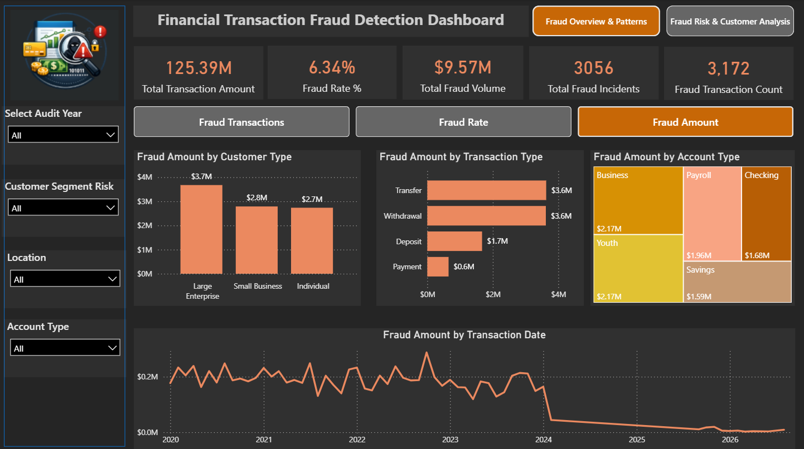
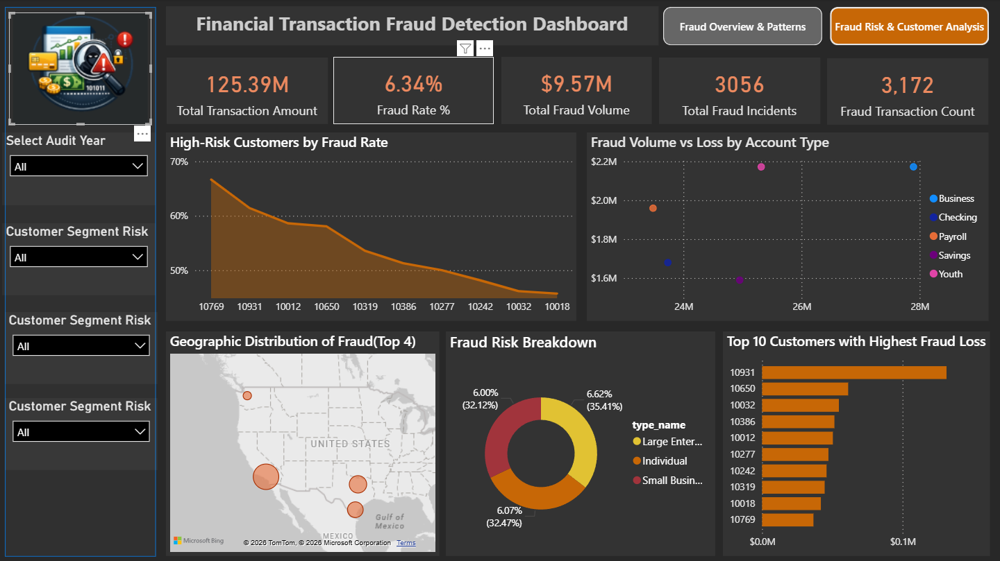

# Financial Transaction Fraud Detection Analysis

## Overview

Developed an end-to-end fraud analytics solution to identify suspicious financial transactions using SQL-based fraud detection rules and interactive Power BI dashboards.

The project combines data cleaning, fraud pattern detection, data modeling, and business intelligence reporting to uncover high-risk transactions, customer segments, and account types.

---

## 📊 Dashboard Screenshots

### 1. Fraud Overview Dashboard

### 2. Customer Risk Analysis Dashboard

---

## Tools & Technologies

- Excel
- Power Query
- PostgreSQL
- SQL
- Power BI
- DAX
- Data Modeling

---

## Data Preparation

- Cleaned and transformed raw banking transaction data using Power Query.
- Standardized data types and validated data quality.
- Built a star-schema data model for reporting and analysis.
- **Data Model Architecture:** Designed an efficient Star Schema by establishing clean 1-to-many relationships between centralized transactional fact tables and optimized dimension tables (public_customers, public_addresses, Dim Calendar).

---

## Fraud Detection Rules Implemented

### High Velocity Transactions
Identified accounts performing multiple transactions within a 5-minute window.

### Spiking Transaction Values
Flaged withdrawals/transfers exceeding 70% of account balance.

### Rapid Funds Drain Detection
Detected accounts receiving funds and transferring them out on the same day.

### Transaction Outlier Detection
Identified transactions exceeding 3× the customer's moving average.

### Smurfing Detection
Detected structured deposits designed to avoid regulatory reporting thresholds.

---

## Dashboard Features

- Fraud Transaction Analysis
- Fraud Rate Analysis
- Fraud Amount Analysis
- Customer Risk Segmentation
- Account Type Risk Assessment
- Geographic Fraud Distribution
- Top Fraud Loss Customers
- Interactive Filtering & Navigation

---

## Key Insights

- Total Transaction Amount: **$125.39M**
- Fraud Rate: **6.34%**
- Total Fraud Volume: **$9.57M**
- Fraud Incidents Identified: **3,056**
- Fraud Transactions: **3,172**
- Transfer and Withdrawal channels carry the highest financial exposure, combining for **$7.2M of the total fraud volume**.
- Large Enterprise customers generated the highest fraud loss (**$3.7M**).
- Youth accounts recorded the highest fraud rate (**7.34%**).

---

## Business Impact

This solution enables financial institutions to proactively identify suspicious transaction patterns, prioritize high-risk customer segments, and strengthen fraud monitoring through data-driven decision-making.

---

## Skills Demonstrated

- Data Cleaning
- Power Query
- SQL
- PostgreSQL
- Fraud Analytics
- Data Modeling
- DAX
- Power BI
- Dashboard Development
- Business Intelligence
- Data Visualization

---

## Files Included
- Power BI Dashboard (.pbix)
- SQL Queries (.sql)
- Dashboard Screenshots (.png)
- Documentation (README.md)

---

## Author
Prabha R
---
